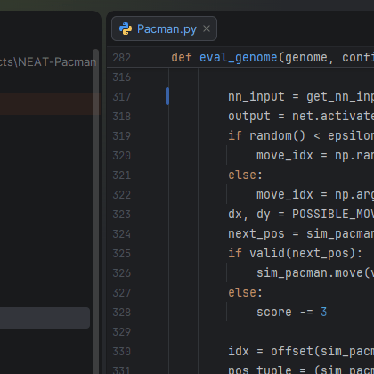
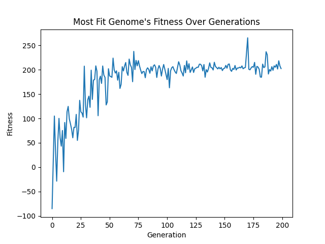

# NEAT-Pacman

NEAT-Pacman is a Pacman agent trained with NEAT (NeuroEvolution of Augmenting Topologies).
It learns to move through the maze and eat dots over many generations.

## Demo

Trained agent replay: \

\
\
Fitness history:\


## Project structure

- `src/Pacman.py`: game simulation, training, and replay
- `src/optimize.py`: Optuna hyperparameter tuning
- `src/config/neat_config.txt`: NEAT settings
- `src/outputs/`: generated training and replay files
- `assets/`: images and gif used in this README

## Getting started

Requirements:
- Python 3.7+
- Windows or macOS for GIF export with `PIL.ImageGrab`

Install dependencies:

```bash
pip install -r requirements.txt
```

## Usage

Run commands from `src/`:

```bash
cd src
```

Train an agent:

```bash
python Pacman.py
```

Then select option `1`.

Replay the best agent:

```bash
python Pacman.py
```

Then select option `2`.

Replay a specific generation:

```bash
python Pacman.py
```

Then select option `3` and enter a generation (example: `042`).

Tune hyperparameters:

```bash
python optimize.py
```

## Configuration

Main config file:
- `src/config/neat_config.txt`

Important constants are in:
- `src/Pacman.py`

## References

- https://neat-python.readthedocs.io/en/latest/
- https://optuna.org/
- https://pypi.org/project/freegames/
- https://github.com/grantjenks/free-python-games

## License

MIT License: [LICENSE](LICENSE)
